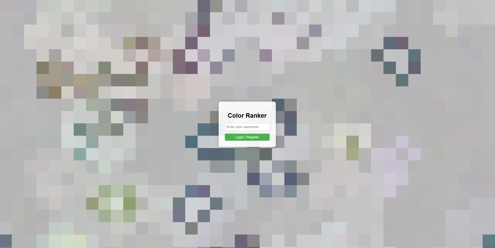
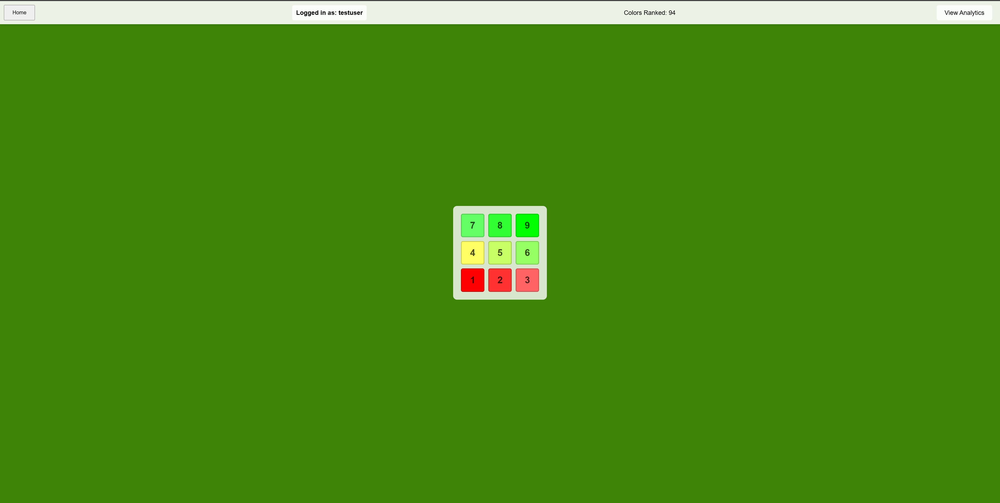
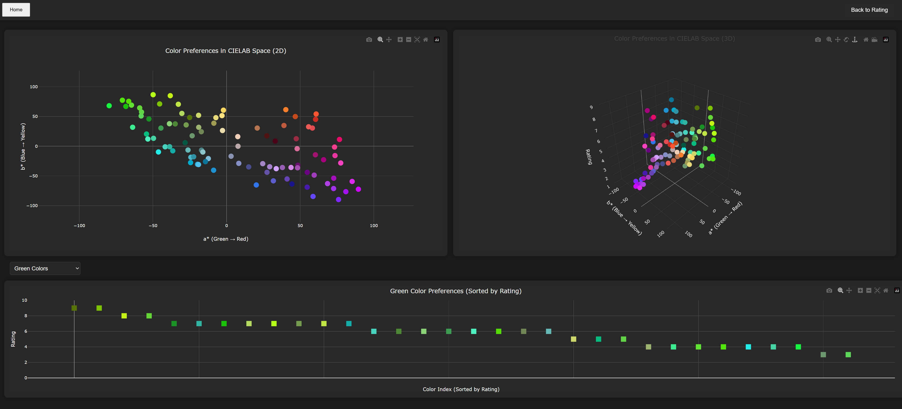

# color_explorer
Discover trends in what colors you like and dislike

## Setup

```bash
# create the virtual environment
python -m venv venv

# activate the virtual environment
source venv/bin/activate

# install the dependencies
pip install -r requirements.txt
```

## Run

```bash
# run the app
uvicorn colorgame.app.main:app --port 16480 --reload
```

## Screenshots
Users can login to their particular name (no passwords used, this isn't sensitive data (add if you feel like it)). User can then rate as many colors as they feel like. There are ~16 million colors to choose from, chosen randomly from the entire color space (with bias to fill in the gaps). View the analytics page to see the results. I hope to add more analytic insights in the future.








